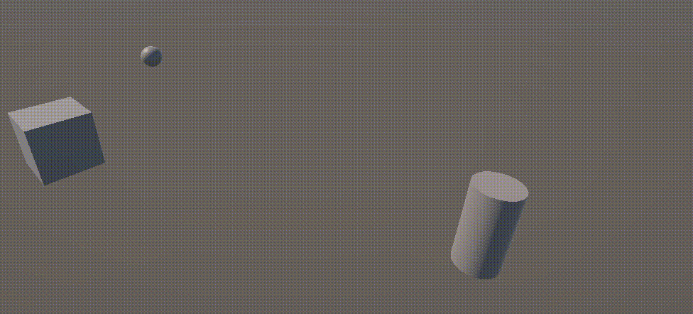
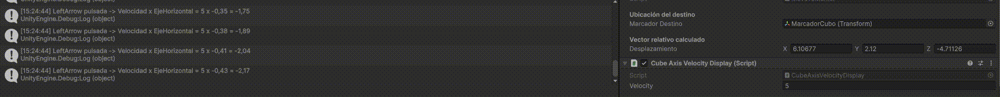
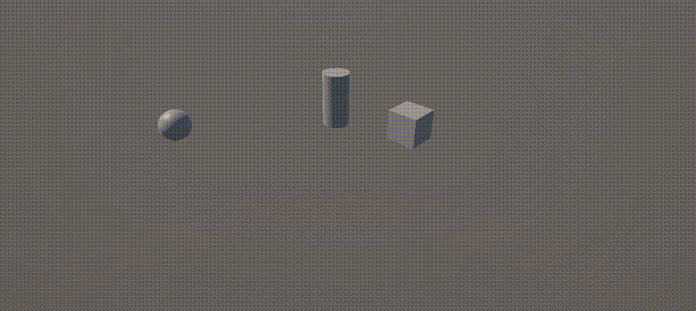
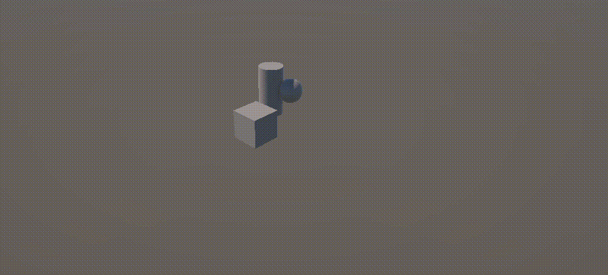
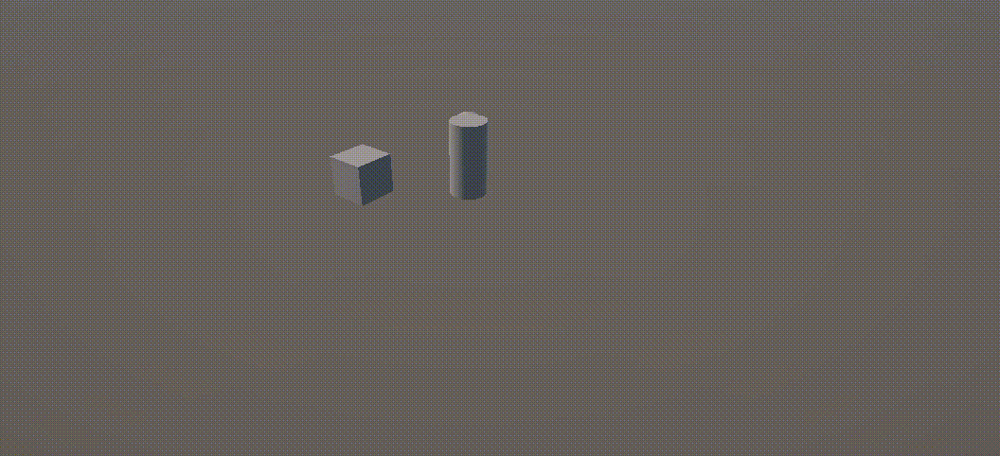
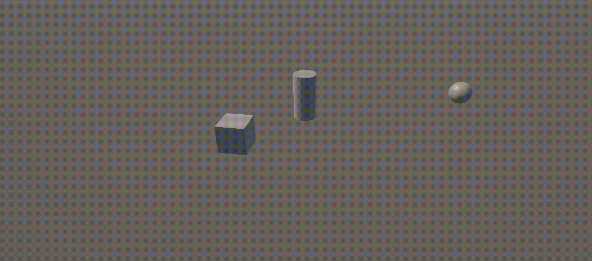

# Práctica: Movimiento y Control de Objetos en Unity

**Estudiante:** Adriel Reyes  
**Grado:** Grado en Ingeniería Informática

---

## 1. Estructura del Proyecto y Scripts Implementados

El proyecto se organiza bajo la carpeta principal de scripts con responsabilidades modulares e independientes:

* `Assets/Scripts/MoveToMarker.cs`: Cálculo de vectores de desplazamiento relativo hacia marcadores de destino en la escena mediante el botón de salto.
* `Assets/Scripts/CubeAxisVelocityDisplay.cs`: Manejo de entradas ortogonales y cálculo de velocidad sobre ejes virtuales.
* `Assets/Scripts/FireKeyTest.cs`: Verificación y remapeo de botones virtuales en el *Input Manager*.
* `Assets/Scripts/CubeMover.cs`: Traslación continua proporcional y experimentación de sistemas de referencia locales vs. mundiales.
* `Assets/Scripts/ArrowKeyMovement.cs`: Control manual del Cubo mediante teclas de dirección (flechas).
* `Assets/Scripts/WASDMovement.cs`: Control manual de la Esfera mediante teclas de carácter WASD.
* `Assets/Scripts/FollowTarget.cs`: Algoritmo de seguimiento continuo a velocidad constante con normalización vectorial y zona muerta de aproximación.
* `Assets/Scripts/ForwardMovementController.cs`: Control de orientación manual en el eje vertical Y y avance cinemático continuo en dirección frontal con depuración visual.

---

## 2. Desarrollo y Respuestas Técnicas a los Ejercicios

### Ejercicio: Desplazamiento relativo hacia marcador
* **Script:** `MoveToMarker.cs`
* **Fundamento técnico:** En el método `Start()`, se determina el vector de desplazamiento relativo mediante la diferencia entre la posición del marcador objetivo y la posición inicial del objeto ($\vec{d} = \mathbf{p}_{\text{marcador}} - \mathbf{p}_{\text{origen}}$). Al pulsar el eje virtual de salto (`Jump`), el objeto suma dicho vector a su posición original, trasladándose instantáneamente a su destino asignado.

---

### Ejercicio 6: Detección ortogonal de ejes y velocidad
* **Script:** `CubeAxisVelocityDisplay.cs`
* **Justificación técnica:** Se estructuró la evaluación de pulsaciones en dos bloques condicionales independientes (uno para el eje Vertical y otro para el eje Horizontal). El uso de un único bloque encadenado `if ... else if` inhibiría la detección simultánea de combinaciones en diagonal (por ejemplo, presionar `UpArrow` y `RightArrow` al mismo tiempo), perdiendo información de un eje por prioridad de evaluación en la rama.

---

### Ejercicio 7: Mapeo de la tecla H a la función de disparo
* **Script:** `FireKeyTest.cs`
* **Configuración del Input Manager:**
  * En `Edit > Project Settings > Input Manager > Axes > Fire1`, se redefinió el parámetro `Positive Button` asignando la tecla `h`.
* **Diferenciación de métodos:**
  * `Input.GetButtonDown("Fire1")`: Activa el disparo exclusivamente en el primer frame en el que la tecla `H` pasa a estado presionado (ideal para disparo semiautomático).
  * `Input.GetButton("Fire1")`: Devuelve `true` de manera ininterrumpida durante todos los frames en que se mantenga pulsada la tecla (disparo continuo o automático).

---

### Ejercicio 8: Traslación continua y análisis de sistemas de coordenadas
* **Script:** `CubeMover.cs`
* **Análisis de las cuestiones planteadas:**
  * **a. Duplicar las coordenadas de `moveDirection`:** Al duplicar las componentes del vector ($2\vec{d}$), se duplica su norma euclídea $\Vert{}\vec{d}\Vert{}$. Como el desplazamiento por frame es el producto escalar-vectorial $\vec{d} \cdot v \cdot \Delta t$, la magnitud efectiva del avance se duplica ($2\times$ velocidad visual).
  * **b. Duplicar la velocidad (`speed`) manteniendo `moveDirection`:** El efecto cinemático es indistinguible del caso anterior; el factor escalar $2$ distribuye linealmente multiplicando al vector de traslación, duplicando la distancia recorrida por unidad de tiempo.
  * **c. La velocidad es menor que 1 ($v < 1$):** La traslación por segundo resulta ser una fracción submétrica de la magnitud del vector director, produciendo un avance ralentizado.
  * **d. La posición del cubo tiene $y > 0$:** Si la componente vertical de traslación es cero y se opera en `Space.World`, el objeto se traslada suspendido paralelamente sobre el plano horizontal $XZ$ conservando su altura. Si se operase en `Space.Self` con el objeto cabeceado (rotado en $X$ o $Z$), el avance local modificaría su cota vertical respecto al suelo del mundo.
  * **e. Intercambio entre `Space.Self` y `Space.World`:** 
    * En `Space.World`, el cubo se desplaza guiándose por la brújula absoluta de la escena ($X, Y, Z$ globales) con total independencia de su giro.
    * En `Space.Self`, el desplazamiento se proyecta sobre los ejes intrínsecos del objeto. Si el cubo tiene una rotación en $Y$, avanzar en $+Z$ local provocará un desplazamiento en la dirección hacia donde apunta su cara frontal en el mundo.

---

### Ejercicios 9 y 10: Control de dos entidades y regularización con `Time.deltaTime`
* **Scripts:** `ArrowKeyMovement.cs` y `WASDMovement.cs`
* **Aislamiento de controles:** Se desacopló la lectura de ejes virtuales mediante lecturas directas de `KeyCode` para evitar que la configuración por defecto de Unity solapara el control entre el Cubo y la Esfera.
* **Justificación de `Time.deltaTime`:**
  * En una ejecución sin regularización temporal, el desplazamiento es una función directa del fotograma: $\Delta x = v \cdot 1\text{ frame}$, haciendo el movimiento dependiente del hardware (a 144 FPS el objeto viaja casi cinco veces más rápido que a 30 FPS).
  * Al introducir el diferencial de tiempo de frame:
    $$\Delta \vec{p} = \vec{v} \cdot \Delta t$$
    la magnitud de `speed` pasa de interpretarse como "unidades por fotograma" a "unidades métricas por segundo", garantizando homogeneidad física ante cualquier fluctuación de rendimiento.

---

### Ejercicio 11: Persecución a velocidad constante y normalización vectorial
* **Script:** `FollowTarget.cs`
* **Fundamento matemático:**
  1. **Vector Dirección:** Se calcula como la resta vectorial entre posiciones relativas:
     $$\vec{d} = \mathbf{p}_{\text{esfera}} - \mathbf{p}_{\text{cubo}}$$
  2. **Restricción de cota:** Se anula la componente vertical ($d_y = 0$) para obligar al cubo a permanecer confinado en su plano horizontal.
  3. **Normalización (`direccion.normalized`):** Si no se normaliza, la velocidad sería proporcional a la distancia $\Vert{}\vec{d}\Vert{}$ (lejos iría acelerado y cerca desacelerado). Al normalizar, $\Vert{}\hat{d}\Vert{} = 1$, consiguiendo que el módulo del desplazamiento por segundo dependa única y exclusivamente de la constante `speed`.
  4. **Zona muerta (`magnitude > 0.05f`):** Evita la indeterminación matemática por división entre cero en la normalización $(\frac{\vec{0}}{0})$ cuando ambos objetos colapsan en el mismo punto, eliminando simultáneamente el temblor o sobreoscilación (*jittering*) de signo entre frames contiguos.

---

### Ejercicio 12: Alineamiento dinámico con `LookAt`
* **Script:** `FollowTarget.cs` / `LookAtAndFollow.cs`
* **Mecánica:**
  * Se proyecta un punto auxiliar $\mathbf{p}_{\text{plana}} = (x_{\text{obj}}, y_{\text{cubo}}, z_{\text{obj}})$ y se invoca `transform.LookAt(\mathbf{p}_{\text{plana}})`.
  * Esto rota la base de coordenadas del cubo de manera que su eje local $+Z$ (`transform.forward`) coincida exactamente con la línea de visión del objetivo, manteniendo nulos los ángulos de balanceo (*roll*) y cabeceo (*pitch*).
  * Al estar orientado, el avance frontal se realiza en su propio espacio local mediante `transform.Translate(Vector3.forward * speed * Time.deltaTime, Space.Self)`.

---

### Ejercicio 13: Giro manual por eje horizontal y avance continuo con `transform.forward`
* **Script:** `ForwardMovementController.cs`
* **Conceptos clave:**
  1. **Rotación sobre el eje Y:** Se calcula el giro angular $\theta = \text{Input} \times \text{turnSpeed} \times \Delta t$ y se aplica con `transform.Rotate(0, \theta, 0)`. Se utiliza el eje vertical $Y$ para alterar únicamente la guiñada (*yaw*) del objeto sobre el plano del suelo.
  2. **`transform.forward` vs `Vector3.forward`:** 
     * `Vector3.forward` es un vector constante estático global $(0, 0, 1)$.
     * `transform.forward` es la proyección en espacio del mundo del eje $Z$ local del objeto. Refleja dinámicamente hacia dónde está orientada la cara frontal tras las rotaciones.
  3. **Depuración visual (`Debug.DrawRay`):** Permite proyectar en la vista de escena un vector visual que nace en el centro geométrico del cubo y se alinea con `transform.forward`, verificando visualmente la coincidencia exacta entre la orientación geométrica y el vector director del movimiento.

